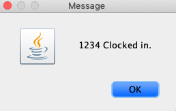
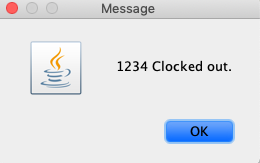
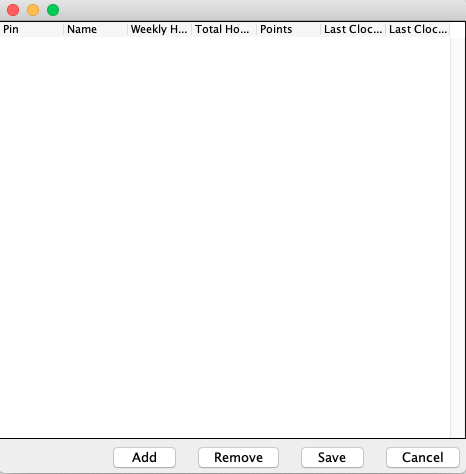
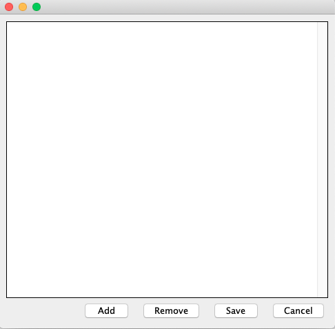

# User Manual

## **Description**

This user manual will describe features of the PaperBack Writer and how to do them step-by-step.

## **Features**
- Clock In/Out
- Confirm Event Attendence8
- View Employees
- Add New Employees
- Manage Events

  

## *Clock In/Out*
1. Within the main menu, press the button "Clock In/Out." The following window will pop-up.

  

2. A new pop-up will appear asking for a PIN number.

3. The user shall enter their unqiue PIN. Then press the Clock In/Out button.

4A. A prompt will pop-up notifying the user of a successful clock in or out.

  or     

4B. If the user enters a PIN not found or invaild the following pop-up will occur. The user should refer back to step 3 when this occurs.

  

## *Confirm Event Attendence*
1. Within the main menu, press the button "Confirm Event Attendence." The following window will pop-up.
  

2. The user will use the drop down box to select a registered event that exists.

3. The user will then enter their unique pin to confirm their attendence to the event.

## *View Employees*
1A. Within the main menu, press the button "View Employees." 

1B. A prompt for a manager password will pop-up to proceed.

2. Within the window the user shall be able to see employees registed in the system.

3. The manager can then either use the 'Add" button to add a row for a new employee or "Remove" to removed a row.

4. The manager then can save the changes made by pressing the "Save" button.

## *Add New Employees*
1A. Within the main menu, press the button "Add New Employee." 

1B. A prompt for a manager password will pop-up to proceed.
[Add Employee](AddEmployee.png)

2. The manager can enter the required information into each field.

3. The manager then presses the "Confirm" button to finally create a new employee.

## *Manage Events*
1. Within the main menu, press the button "Manage Events." The following window will pop-up.

2. This window displays the events created by a manager. These events will be used for "Confirming Event."

3. A manager can create a new event using the "Add" button.
