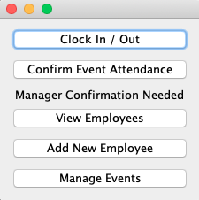
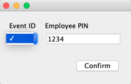

# User Manual

## **Description**

This user manual will describe features of the PaperBack Writer and how to do them step-by-step.

## **Features**
- Clock In/Out
- Confirm Event Attendence8
- View Employees
- Add New Employees
- Manage Events

  

## *Clock In/Out*
1. Within the main menu, press the button "Clock In/Out."

  

2. A new pop-up will appear asking for a PIN number.

3. The user shall enter their unqiue PIN. Then press the Clock In/Out button.

4A. A prompt will pop-up notifying the user of a successful clock in or out.

4B. If the user enters a PIN not found or invaild the following pop-up will occur. The user should 

  

## *Confirm Event Attendence*

  

## *View Employees*

## *Add New Employees*

## *Manage Events*
